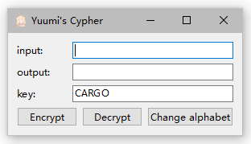
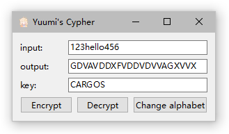
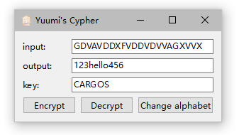

# Yuumi's ADFGVX Cypher

该程序为ADFGVX密码的实现，已上传[Github](https://github.com/Yuumi0221/ADFGVX-Cypher)。重要文件结构如下：

```
├─myCypher
│      adgfvxalgo.cpp	// 密码类
│      adgfvxalgo.h		// 密码头文件
│      CMakeLists.txt	// CMakeList
│      main.cpp			// 主程序
│      widget.cpp		// 界面程序
│      widget.h			// 界面头文件
└─release
    │  ChangeAlphabet.txt	// 预留的密码表更改文件
    │  myCypher.exe		// 可执行程序
    │  README.md		// 此文件
```


## 程序使用

`release` 目录下的 `myCypher.exe` 为程序的可执行文件，下文将介绍其[使用方法](#使用方法)。

### 运行环境

- Windows 64位操作系统

### 使用方法

1. **运行程序**：双击打开 `myCypher.exe` ，看到界面，则运行成功。

	

2. **明文加密**：在 `input` 框中输入需要加密的明文信息，在 `key` 框中输入置换密码的密钥。点击 `Encrypt` ，在 `output` 框中会出现加密结果。

	- 明文仅可输入英文字母或数字，大写字母将自动转换为小写字母；
	- 密钥仅可输入英文字母，小写字母将自动转换为大写字母；
	- 若未输入密钥，则将使用默认密钥 `CARGO` 进行加密。

	

3. **密文解密**：在 `input` 框中输入需要解密的密文信息，在 `key` 框中输入置换密码的密钥。点击 `Decrypt` ，在 `output` 框中会出现解密结果。

	- 仅可输入符合ADFGVX密码要求的密文（只包含“ADFGVX”六个大写字母）；
	- 密钥要求同上。

	

4. **更改ADFGVX密码表**：点击 `Change alphabet` ，弹出框中选择密码表文件，即可切换密码表。

	- 密码表需为 .txt 文件，内容为26个英文字母与数字0~9的随意排列。例如：

		```
		wxydefghi123klmn567optuvcba0489jqrsz
		```
	- 若密码表未更改，则默认为：
	
		```
		xyzdefghiklmnopqrstuvwcba0123456789j
		```


## 开发设计

该程序使用QT框架，C++编写。

### 开发环境

- QT 6.4.0
- MinGW 11.2.0
- C++ 11

### 算法和程序设计

ADFGVX加密算法是一种结合了扩展的Polybius密码和置换密码的双重加密方案，具体算法内容参考 [ADFGVX密码简介.pdf](ADFGVX密码简介.pdf) 文件。

#### 程序设计

由于ADFGVX加密算法中的密码表、置换密钥均为人为设置、可以改动的变量，且密码表不常更换、置换密钥较常更换。因此除了输入、输出框外，另外设计了密钥输入框和更改密码表按钮。加密算法类成员函数设计如下(`adgfvxalgo.h`)：

```c++
ADGFVXalgo(string cargo);   //构造函数
void encrypt();     // 加密操作
void decrypt();     // 解密操作
void setMessage(string str);    // 设置明文
void setCypher(string str);     // 设置密文
void setCargo(string str);      // 设置密钥
void setADGFVXinput(string str);    // 设置密码表
string getCypher();     // 获取密文
string getMessage();    // 获取明文
```

#### 加密设计

为了快速查找到明文在密码表中对应的密文，我先将字符串类型的密码表转换为map：

```c++
// 建表
multimap<char, pair<char, char>> table;
char charList[6] = {'A', 'D', 'F', 'G', 'V', 'X'};
int i=0, j=0, pos=0;
for(i = 0; i < 6; i++) {
    for(j = 0; j < 6; j++) {
        table.insert({ADGFVXtable[pos], {charList[i], charList[j]}});
        pos++;
    }
}
```

接着通过查找转换好的密码表来输出第一道密文到 `midCypher` 中，便完成了扩展的Polybius密码算法：

```c++
// polybius密码
vector<char> midCypher;
for (auto alpha: input){
    auto iter = table.find(alpha);
    midCypher.push_back(iter->second.first);
    midCypher.push_back(iter->second.second);
}
```

最后用sort函数得到密钥的字典序，以 `pos` 来标明字典序位置，输出列到 `cypher` 即可。

```c++
// 置换密码
string str = CARGOinput;
sort(str.begin(), str.end());
pos = 0;
for (auto ch: str){
    pos = CARGOinput.find(ch);
    for (i=0; i < midCypher.size()/CARGOinput.length(); i++)
        cypher.push_back(midCypher[i * CARGOinput.length() + pos]);
}
```

但是！如果polybius得到的第一道密文长度不能被密钥长度整除，当整除时会漏掉密文的最后几位。因此还需要考虑不整除的情况。因为在不整除的情况下，即“置换表格不能被填满”时，空缺的一定是最后一行右侧的位置。因此用 `remainder` 来保存余数，若为密钥的前 `remainder` 列，则输出 `密文长度/密钥长度+1` 个字母；若不为前 `remainder` 列，则输出 `密文长度/密钥长度` 个字母即可。

```c++
// 置换表格不满
int remainder = midCypher.size()%CARGOinput.length();
string str = CARGOinput;
sort(str.begin(), str.end());
pos = 0;
for (auto ch: str){
    pos = CARGOinput.find(ch);
    if (pos < remainder)
        for (i=0; i < midCypher.size()/CARGOinput.length()+1; i++)
            cypher.push_back(midCypher[i * CARGOinput.length() + pos]);
    else
        for (i=0; i < midCypher.size()/CARGOinput.length(); i++)
            cypher.push_back(midCypher[i * CARGOinput.length() + pos]);
```

#### 解密设计

加密的过程是 polybius -> 置换，因此解密过程为 反置换 -> 反polybius。建表操作、反polybius和加密基本相同，不过要将map中的键值反转一下。置换解密的可整除部分也大差不差，就是输出也需要翻转一下，是从字典序到密钥原来的顺序。

但是不可整除的置换解密就要复杂一点。如果不可整除，例如明文为 `12hello` ，密钥为 `CRAGOS` ，则第一道密文为 `VF VG DD AV DV DV FD`  ，放入置换列表后会看到：

|  C   |  R   |  A   |  G   |  O   |  S   |
| :--: | :--: | :--: | :--: | :--: | :--: |
|  V   |  F   |  V   |  G   |  D   |  D   |
|  A   |  V   |  D   |  V   |  D   |  V   |
|  F   |  D   |      |      |      |      |

置换后输出为 `VD VAF GV DD FVD DV` 。可以发现无法直接用数学循环找到某个字母下的列，因为每一列的长度是不一样的。我的解决方案为：因为我们知道密文的长度、知道具体的密钥，所以我们必然知道会多出来几个字母（余数有几位），以及置换前后的密钥列顺序。因此我们只需要把 "除了前(余数)位的列" 以外的所有列 的最后都填上某个字符，就可以保证置换列表是一个满列表，从而循环输出了。因为知道余数是多少，且密文只会有ADFGVX，因此不会对正确性造成影响。

为此我新建了一个vector来保存哪些列为密钥的前(余数)列，在非前(余数)列的末尾加上'0'，并在顺序输出时无视'0'，即可成功反置换回来。

```c++
vector<int> temp;
for (i=0; i<remainder; i++) {
    pos = str.find(CARGOinput[i]);
    temp.push_back(pos);
}
for (i=0; i<CARGOinput.length(); i++){
    if (find(temp.begin(), temp.end(), i) != temp.end())
        continue;
    input.insert(input.begin() + (i * (cypher.size()/CARGOinput.length()+1)) + cypher.size()/CARGOinput.length(), '0');
}
for (i=0; i<input.size()/CARGOinput.length(); i++){
    for (auto ch: CARGOinput){
        pos = str.find(ch);
        char tempChar = input[pos * (input.size()/CARGOinput.length()) + i];
        if (tempChar == '0') continue;
        else    midCypher.push_back(tempChar);
    }
}
```